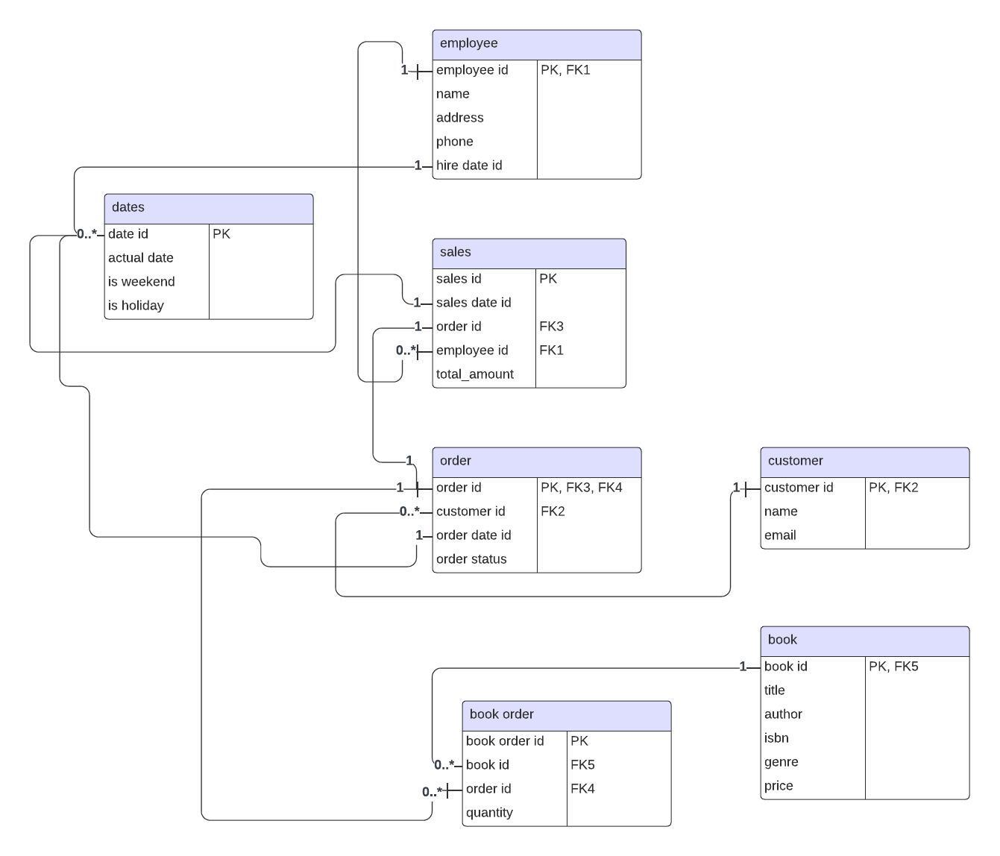
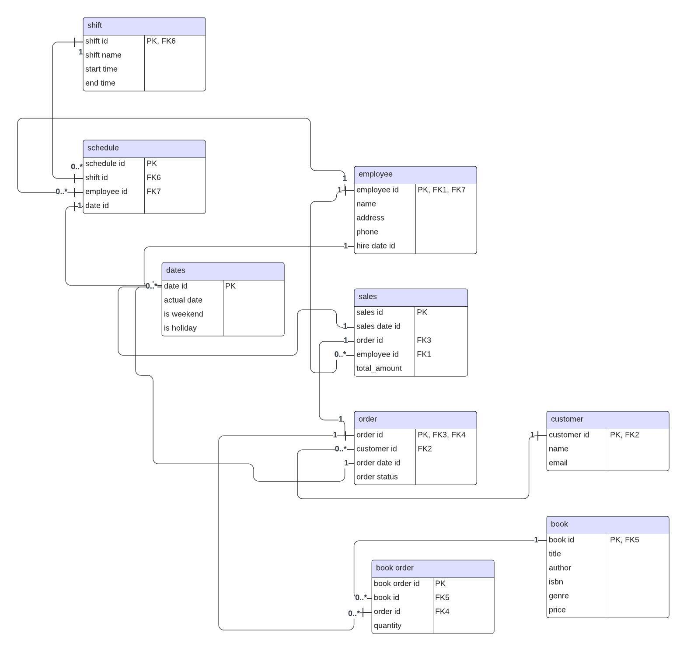

# Assignment 1: Design a Logical Model

## Question 1
Create a logical model for a small bookstore. 📚

At the minimum it should have employee, order, sales, customer, and book entities (tables). Determine sensible column and table design based on what you know about these concepts. Keep it simple, but work out sensible relationships to keep tables reasonably sized. Include a date table. There are several tools online you can use, I'd recommend [_Draw.io_](https://www.drawio.com/) or [_LucidChart_](https://www.lucidchart.com/pages/).

## Bookstore ERD


## Question 2
We want to create employee shifts, splitting up the day into morning and evening. Add this to the ERD.
## Bookstore ERD-Updated


## Question 3
The store wants to keep customer addresses. Propose two architectures for the CUSTOMER_ADDRESS table, one that will retain changes, and another that will overwrite. Which is type 1, which is type 2?

_Hint, search type 1 vs type 2 slowly changing dimensions._

Bonus: Are there privacy implications to this, why or why not?

1. Overwriting Architecture (Type 1 SCD):
   Type 1 Slowly Changing Dimension (SCD)
```
In this architectural model the current address information for each customer is stored.
When a customer's address changes, the existing record is overwritten with the new information.
No historical data about past addresses is maintained.

Benefits:
Simple to implement and manage.
Less storage space required.

Drawbacks:
Loses historical information about customer addresses.
If the Customer order requires an Address, then it should be stored in the transaction table (Order).

```

2. Historical Architecture (Type 2 SCD):
   Type 2 Slowly Changing Dimension (SCD)
```Explanation:
In this architectural model historical address information for each customer is stored.
When a customer's address changes, perhaps a Customer form is created and current address is retrieved, then, a new record is inserted with the new information and a valid_from date set to the current date.

The existing record's valid_to date is updated to the day before the new address becomes valid.
This allows you to track all the addresses a customer has had over time.

Benefits:
Maintains a complete history of customer addresses.
Enables analysis of customer relocation trends.

Drawbacks:
More complex to manage and requires additional storage space.
Queries might need to consider the valid_from and valid_to dates for accurate results.

```
### BONUS:
Privacy Implications of Storing Customer Addresses

Storing customer addresses does have privacy implications to consider.  The chosen architecture (how you store the data) might require additional actions to comply with customer rights and local regulations. This is especially true when opting for the historical approach (Type 2 Slowly Changing Dimension - SCD). Here's a breakdown:

Type 1 SCD (Overwriting Address):

Lower Privacy Risk: This model stores only the current address, minimizing the amount of personal information retained. It's less likely to raise privacy concerns as long as you have proper data security measures in place.<br/>

Type 2 SCD (Historical):

Higher Privacy Risk:  This approach keeps a history of all customer addresses, which can be considered more sensitive data. Here are some preventative actions to consider:

Data Retention: Storing historical data increases the amount of customer information you hold. This approach requires stricter data retention policies and disposal procedures.
Regulations: Customers have rights to access, rectify, or request deletion of their historical address information. You need to implement mechanisms to address such requests.
Security Risks: A larger data footprint increases the potential attack surface for breaches or unauthorized access. Implementing strong security measures is crucial.
General Privacy Considerations:

Regardless of the chosen architecture:

Customer Consent: Obtain customer consent for collecting and storing address information, especially if you plan to use it for purposes beyond order fulfillment.


## Question 4
Review the AdventureWorks Schema [here](https://i.stack.imgur.com/LMu4W.gif)

Highlight at least two differences between it and your ERD. Would you change anything in yours?
```

1. Focus:

Bookstore Database: Tailored to the core functions of a bookstore, like managing customers, employees, books, orders, and sales.
AdventureWorks: More comprehensive, encompassing a complete sales and purchasing cycle for a fictional manufacturing company.

2. Visual Representation:

Bookstore Database: Focuses on the core bookstore entities, without color-coding departments.
AdventureWorks: Utilizes color coding to visually distinguish tables associated with different departments (e.g., green for Sales, blue for Purchasing).

3. Scope:

Bookstore Database: Designed specifically to meet the business needs of a bookstore.
AdventureWorks: Provides a broader sample database schema applicable to a manufacturing environment.
```

# Criteria

[Assignment Rubric](./assignment_rubric.md)

# Submission Information

🚨 **Please review our [Assignment Submission Guide](https://github.com/UofT-DSI/onboarding/blob/main/onboarding_documents/submissions.md)** 🚨 for detailed instructions on how to format, branch, and submit your work. Following these guidelines is crucial for your submissions to be evaluated correctly.

### Submission Parameters:
* Submission Due Date: `June 1, 2024`
* The branch name for your repo should be: `model-design`
* What to submit for this assignment:
    * This markdown (design_a_logical_model.md) should be populated.
    * Two Entity-Relationship Diagrams (preferably in a pdf, jpeg, png format).
* What the pull request link should look like for this assignment: `https://github.com/<your_github_username>/sql/pull/<pr_id>`
    * Open a private window in your browser. Copy and paste the link to your pull request into the address bar. Make sure you can see your pull request properly. This helps the technical facilitator and learning support staff review your submission easily.

Checklist:
- [ ] Create a branch called `model-design`.
- [ ] Ensure that the repository is public.
- [ ] Review [the PR description guidelines](https://github.com/UofT-DSI/onboarding/blob/main/onboarding_documents/submissions.md#guidelines-for-pull-request-descriptions) and adhere to them.
- [ ] Verify that the link is accessible in a private browser window.

If you encounter any difficulties or have questions, please don't hesitate to reach out to our team via our Slack at `#cohort-3-help`. Our Technical Facilitators and Learning Support staff are here to help you navigate any challenges.
